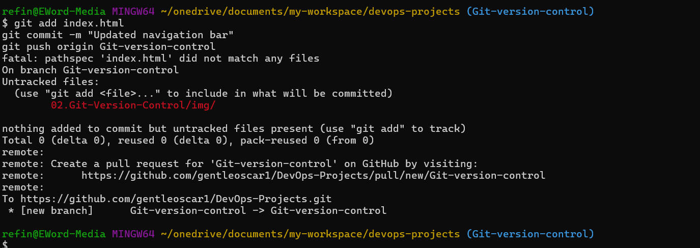
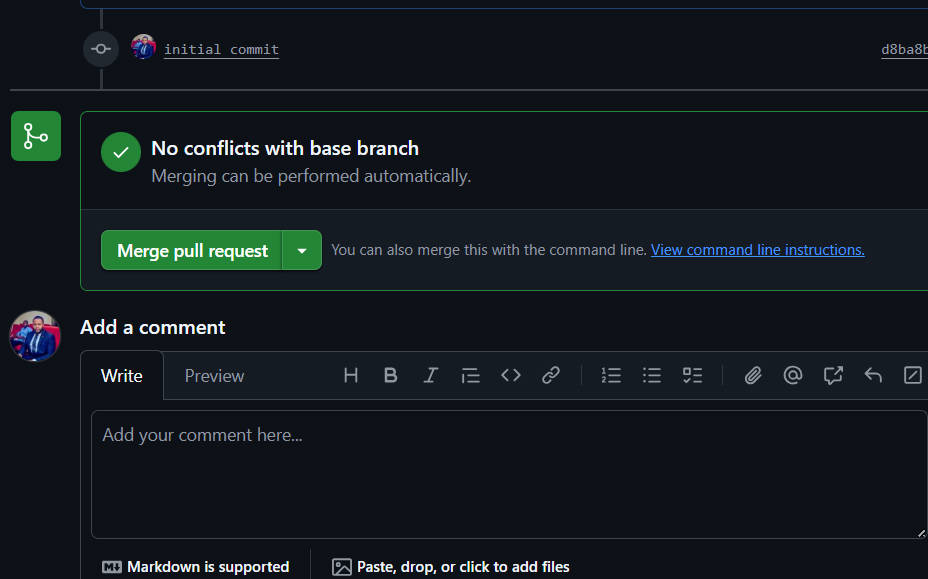

# Git Version Control Mini-Project

This mini-project simulates a collaborative development workflow using Git. It demonstrates how multiple developers (Tom and Jerry) can work on different features of the same file (`index.html`) without overwriting each other's changes.


## Objectives

- Understand Git branching and merging
- Practice resolving merge conflicts
- Learn how to collaborate using GitHub Pull Requests
- Simulate real-world version control scenarios

## Workflow Summary

1. **Clone the repository**
   ```bash
   git clone https://github.com/gentleoscar1/DevOps-Projects.git
   cd DevOps-Projects/02.Git-Version-Control


2. **Create a feature branch**
```bash
git checkout -b Git-version-control
```


3. **Make changes and commit**
```bash
git add index.html
git commit -m "Updated navigation bar"
```



4. **Push and create a Pull Request**
```bash
git push origin Git-version-control
```


5. **Merge and resolve conflicts if needed**
```bash
git pull origin main
git merge main
```




# Conclusion
This project has provided me a hands-on experience with Git version control and simulating real-world collaboration with other developers.